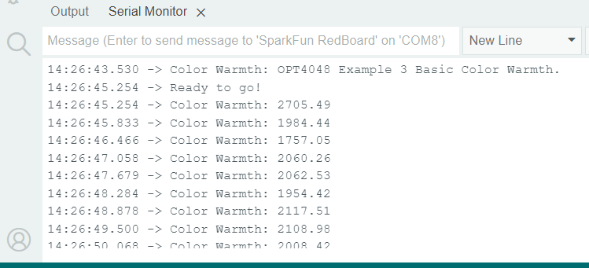

###Example 1: Basic Color Sensing

This first example just does some basic measurements. To find Example 1, go to **File** > **Examples** > **SparkFun Color Sensor OPT4048** > **example1_BasicColorSensing**:


<figure markdown>
[{ width="90%" }](assets/img/Example1_Menu.png "Click to enlarge")
<figcaption markdown>Finding Example 1</figcaption>
</figure>

Alternatively, you can expand the link below and copy and paste the code into a shiny new Arduino sketch: 

??? "Example 1: Basic Color Sensing"
	```
	--8<-- "https://raw.githubusercontent.com/sparkfun/SparkFun_OPT4048_Arduino_Library/main/examples/example1_BasicColorSensing/example1_BasicColorSensing.ino"
	```
 
<figure markdown>
[{ width="90%" }](assets/img/Example1_Output.png "Click to enlarge")
<figcaption markdown>Example 1 Output</figcaption>
</figure>

The CIEx and CIEy values are going to fall somewhere between 0 and 1. Page 35 of the [datasheet](assets/board_files/opt4048.pdf) gives more detail on this, but generally speaking, you can map the predominant color of the space you're measuring using the following: 

<figure markdown>
[{ width="90%" }](assets/img/CIEMap.png "Click to enlarge")
<figcaption markdown>CIE XY and CIE UV space plots of color coordinates</figcaption>
</figure>


###Example 2: Basic Lux Readings

This example measures. To find Example 1, go to **File** > **Examples** > **SparkFun Color Sensor OPT4048** > **example2_BasicLuxSensing**:


<figure markdown>
[{ width="90%" }](assets/img/Example2_Menu.png "Click to enlarge")
<figcaption markdown>Finding Example 2</figcaption>
</figure>

Alternatively, you can expand the link below and copy and paste the code into a shiny new Arduino sketch: 

??? "Example 2: Basic Lux Sensing Arduino Code"
	```
	--8<-- "https://raw.githubusercontent.com/sparkfun/SparkFun_OPT4048_Arduino_Library/main/examples/example2_BasicLuxSensing/example2_BasicLuxSensing.ino"
	```
 
Make sure you've selected the correct board and port in the Tools menu and then hit the upload button. Once the code has finished uploading, go ahead and open a [Serial Monitor](https://learn.sparkfun.com/tutorials/terminal-basics). You should see something similar to the following. 

<figure markdown>
[{ width="90%" }](assets/img/Example2_Output.png "Click to enlarge")
<figcaption markdown>Example 2 Output</figcaption>
</figure>

Lux values will be measured anywhere from 2.15 mlux to 144 klux. Measurements here start at my general office lighting, and then I put my finger over the sensor. 


###Example 3: Basic Color Warmth

This example measures. To find Example 1, go to **File** > **Examples** > **SparkFun Color Sensor OPT4048** > **example3_BasicColorWarmth**:


<figure markdown>
[{ width="90%" }](assets/img/Example3_Menu.png "Click to enlarge")
<figcaption markdown>Finding Example 3</figcaption>
</figure>

Alternatively, you can expand the link below and copy and paste the code into a shiny new Arduino sketch: 

??? "Example 3: Basic Color Warmth Arduino Code"
	```
	--8<-- "https://raw.githubusercontent.com/sparkfun/SparkFun_OPT4048_Arduino_Library/main/examples/example3_BasicColorWarmth/example3_BasicColorWarmth.ino"
	```

Make sure you've selected the correct board and port in the Tools menu and then hit the upload button. Once the code has finished uploading, go ahead and open a [Serial Monitor](https://learn.sparkfun.com/tutorials/terminal-basics). You should see something similar to the following. Note the obvious changes where the sensor was turned upright. 


<figure markdown>
[{ width="90%" }](assets/img/Example3_Output.png "Click to enlarge")
<figcaption markdown>Example 3 Output</figcaption>
</figure>


###Example 4: Color Settings

This example measures. To find Example 1, go to **File** > **Examples** > **SparkFun Color Sensor OPT4048** > **example4_ColorSettings**:


<figure markdown>
[{ width="90%" }](assets/img/Example4_Menu.png "Click to enlarge")
<figcaption markdown>Finding Example 4</figcaption>
</figure>

Alternatively, you can expand the link below and copy and paste the code into a shiny new Arduino sketch: 

??? "Example 4: Basic Color Senttings"
	```
	--8<-- "https://raw.githubusercontent.com/sparkfun/SparkFun_OPT4048_Arduino_Library/main/examples/example4_ColorSettings/example4_ColorSettings.ino"
	```


Make sure you've selected the correct board and port in the Tools menu and then hit the upload button. Once the code has finished uploading, go ahead and open a [Serial Monitor](https://learn.sparkfun.com/tutorials/terminal-basics). You should see something similar to the following. Note the obvious changes where the sensor was turned upright. 


<figure markdown>
[{ width="90%" }](assets/img/Example4_Output.png "Click to enlarge")
<figcaption markdown>Example 4 Output</figcaption>
</figure>


###Example 5: Interrupt

This example measures. To find Example 1, go to **File** > **Examples** > **SparkFun Color Sensor OPT4048** > **example5_Interrupt**:


<figure markdown>
[{ width="90%" }](assets/img/Example5_Menu.png "Click to enlarge")
<figcaption markdown>Finding Example 5</figcaption>
</figure>

Alternatively, you can expand the link below and copy and paste the code into a shiny new Arduino sketch: 

??? "Example 5: Interrupt"
	```
	--8<-- "https://raw.githubusercontent.com/sparkfun/SparkFun_OPT4048_Arduino_Library/main/examples/example5_Interrupt/example5_Interrupt.ino"
	```

Make sure you've selected the correct board and port in the Tools menu and then hit the upload button. Once the code has finished uploading, go ahead and open a [Serial Monitor](https://learn.sparkfun.com/tutorials/terminal-basics). You should see something similar to the following. Note the obvious changes where the sensor was turned upright. 


<figure markdown>
[{ width="90%" }](assets/img/Example5_Output.png "Click to enlarge")
<figcaption markdown>Example 5 Output</figcaption>
</figure>

