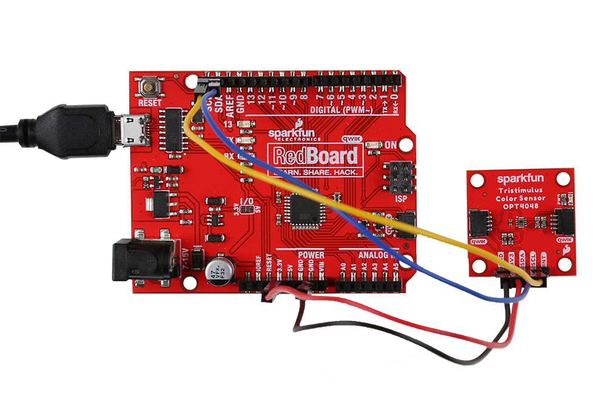
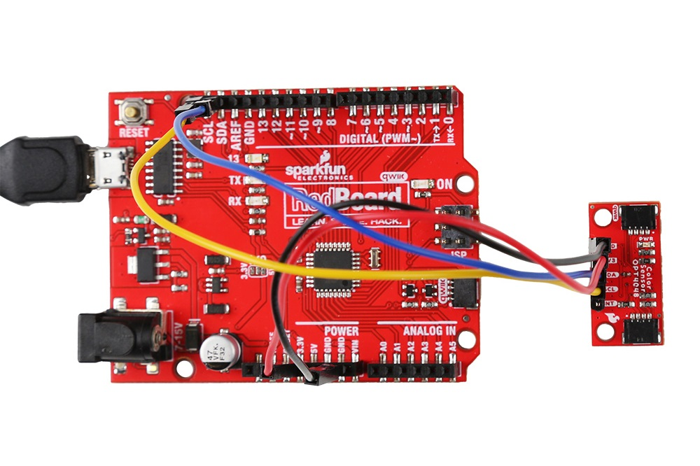

<!-- This section covers any assembly steps needed to complete the guide. Can be very simple but should include a simple assembly (Qwiic, USB, etc.) and a Soldered Assmebly section link to the PTH Soldering Tutorial-->

## Qwiic Assembly

Connecting to the Tristimulus Color breakout is simple. You will just need a microcontroller to process the data when using the OPT4048 and a Qwiic cable. In this case, we used a SparkFun RedBoard Qwiic.

<figure markdown>
[{ width=90% }](assets/img/22638-SparkFun_Tristimulus_Color_Sensor-Hookup.jpg "Click to enlarge")
<figcaption markdown>SparkFun Tristimulus Color Sensor Hooked Up to RedBoard Qwiic via a Qwiic Cable</figcaption>
</figure>

<figure markdown>
[{ width=90% }](assets/img/22639-SparkFun_Tristimulus_Color_Sensor-Hookup.jpg "Click to enlarge")
<figcaption markdown>SparkFun Mini Tristimulus Color Sensor Hooked Up to RedBoard Qwiic via a Qwiic Cable</figcaption>
</figure>

## Soldered Assembly

If you prefer to use the plated through holes on the board, you'll need to solder headers to them. Here we've soldered male headers to the breakout board and attached the jumpers as follows: 

* Yellow = <b>SCL</b>
* Blue = <b>SDA</b>
* Red = <b>3.3V</b>
* Black = <b>GND</b>
* Green = <b>Interrupt</b>

-   <figure markdown>
	
	<figcaption markdown>
	PTH Hookup of Tristimulus Color Sensor
	</figcaption>
	</figure>

-   <figure markdown>
	
	<figcaption markdown>
	PTH Hookup of Mini Tristimulus Color Sensor
	</figcaption>
	</figure>

<table class="pdf">
	<tr>
		<td align="center">
			 
			<i>PTH Hookup of Tristimulus Color Sensor</i>
		</td>
		<td align="center">
			 
			<i>PTH Hookup of Mini Tristimulus Color Sensor</i>
		</td>
	<tr>
</table>

Click on either image for a closer view.

## New to Soldering?

If you have never soldered before or need a quick refresher, check out our [How to Solder: Through-Hole Soldering](https://learn.sparkfun.com/tutorials/how-to-solder-through-hole-soldering) guide.

	<a href="https://learn.sparkfun.com/tutorials/5">
	 
    How to Solder: Through-Hole Soldering</a>

