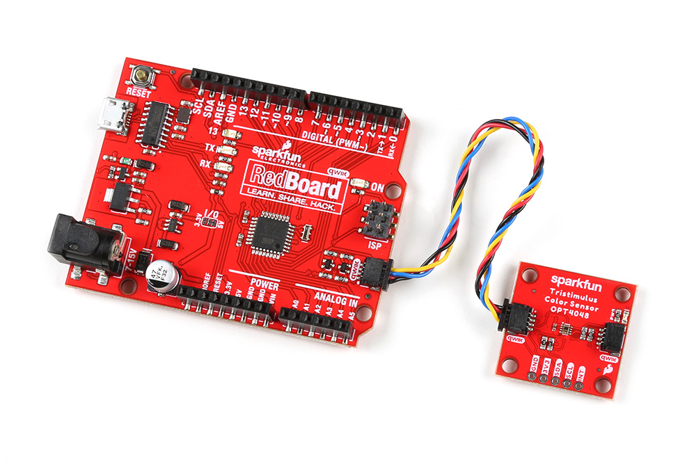
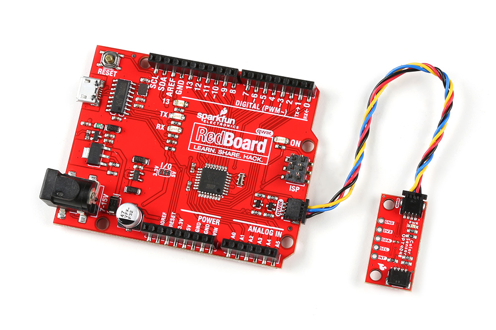

<!-- This section covers any assembly steps needed to complete the guide. Can be very simple but should include a simple assembly (Qwiic, USB, etc.) and a Soldered Assmebly section link to the PTH Soldering Tutorial-->

## Qwiic Assembly

Connecting to the Tristimulus Color breakout is simple. You will just need a microcontroller to process the data when using the OPT4048 and a Qwiic cable. In this case, we used a SparkFun RedBoard Qwiic.

<figure markdown>
[{ width=90% }](assets/img/22638-SparkFun_Tristimulus_Color_Sensor-Hookup.jpg "Click to enlarge")
<figcaption markdown>SparkFun Tristimulus Color Sensor Hooked Up to RedBoard Qwiic via a Qwiic Cable</figcaption>
</figure>

<figure markdown>
[{ width=90% }](assets/img/22639-SparkFun_Tristimulus_Color_Sensor-Hookup.jpg "Click to enlarge")
<figcaption markdown>SparkFun Mini Tristimulus Color Sensor Hooked Up to RedBoard Qwiic via a Qwiic Cable</figcaption>
</figure>

## Soldered Assembly

-   <a href="https://learn.sparkfun.com/tutorials/5">
    <figure markdown>
    
    <figcaption markdown>How to Solder: Through-Hole Soldering</figcaption>
    </figure>
    </a>

??? note "New to soldering?"
	If you have never soldered before or need a quick refresher, check out our [How to Solder: Through-Hole Soldering](https://learn.sparkfun.com/tutorials/how-to-solder-through-hole-soldering) guide.
	

		<a href="https://learn.sparkfun.com/tutorials/5">
		 
        How to Solder: Through-Hole Soldering</a>
	

