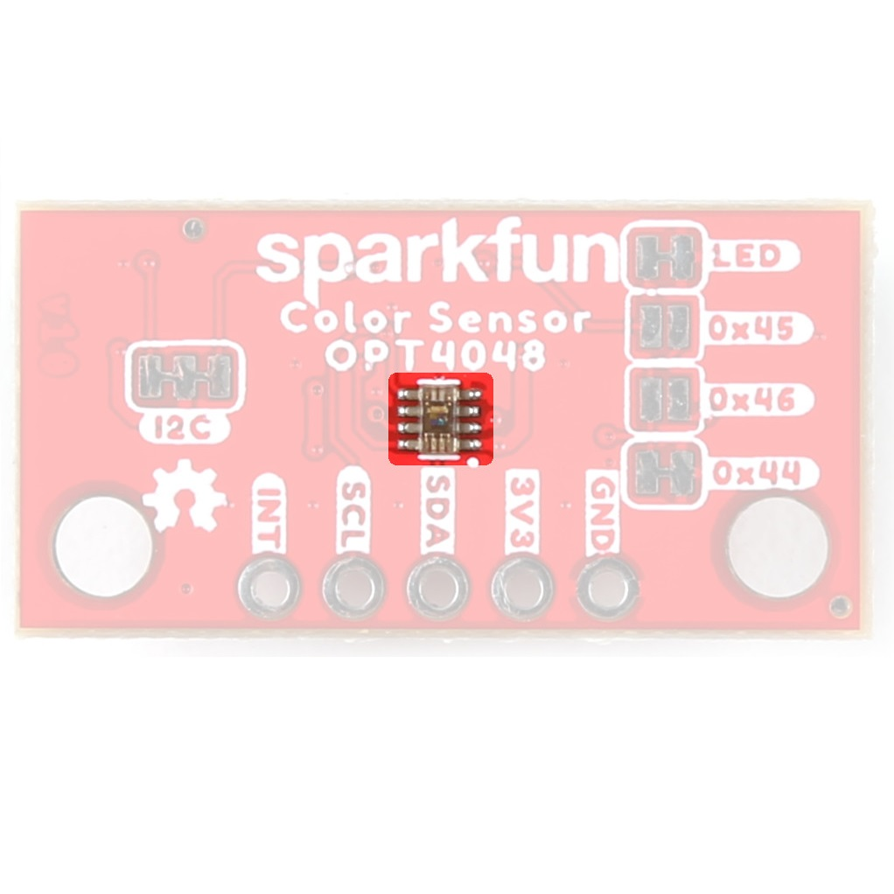
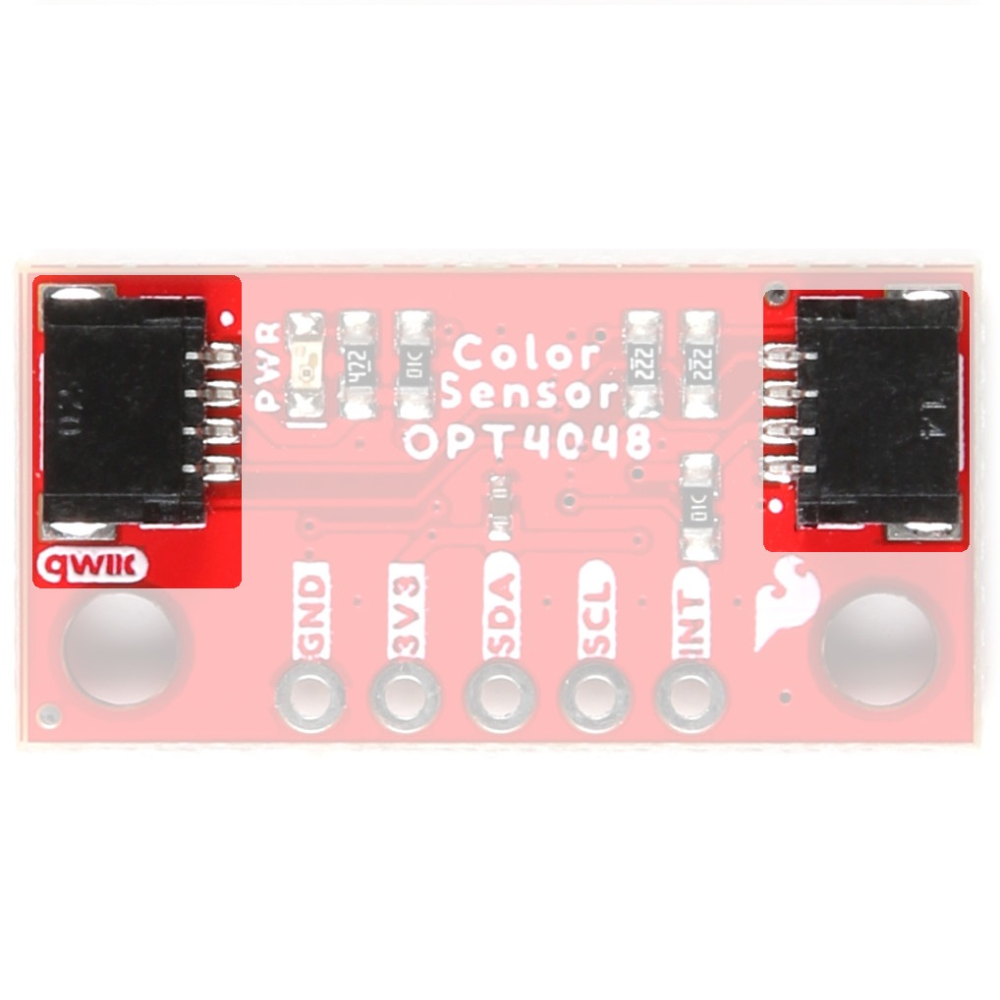
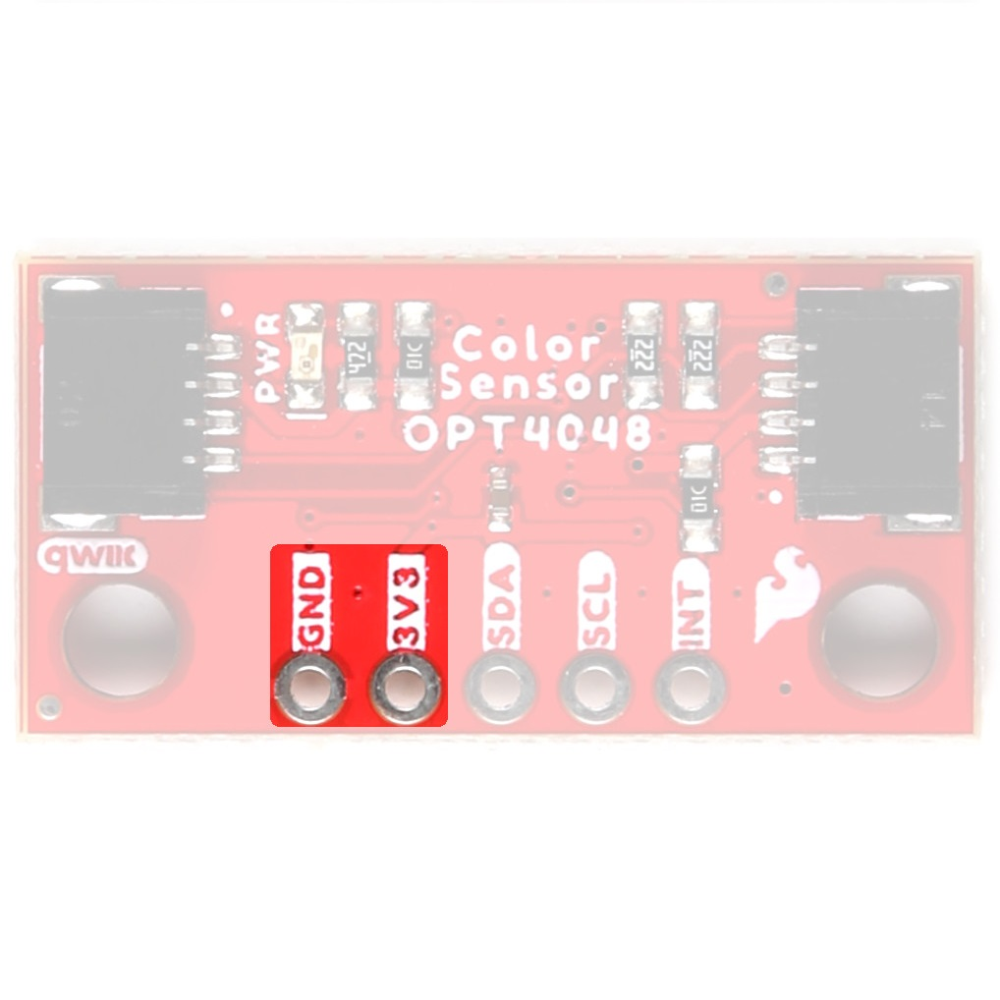
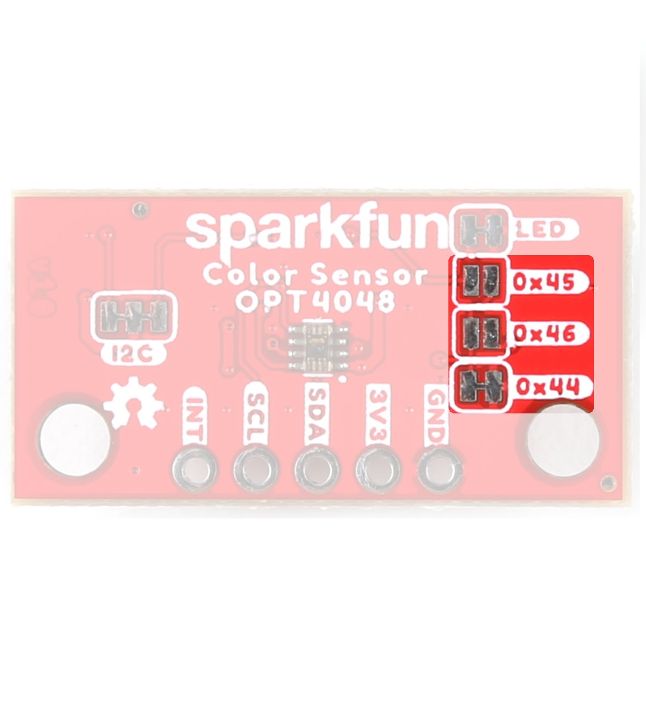

## Color Sensor - OPT4048

The OPT4048 from Texas Instruments is a single-chip high resolution color sensor, capable of measuring four channels each with specific engineered spectral responses. Three of the four channels closely match the CIE tristimulus spectra with the fourth channel having a wide band spectral response. With measurements from these channels, important characteristics of the lighting environment can be extracted like (i) light intensity (lux), (ii) color in CIE XY, LUV coordinates and (iii) Correlated Color Temperature. For more information, refer to the [datasheet](assets/board_files/opt4048.pdf).

<table class="pdf">
	<tr>
		<td align="center">
			 
			<i>The OPT4048 on the Tristimulus Color Sensor.</i>
		</td>
		<td align="center">
			 
			<i>The OPT4048 on the Mini Tristimulus Color Sensor.</i>
		</td>
	<tr>
</table>

-   <figure markdown>
	
	<figcaption markdown>
	The OPT4048 on the Tristimulus Color Sensor.
	</figcaption>
	</figure>

-   <figure markdown>
	
	<figcaption markdown>
	The OPT4048 on the Mini Tristimulus Color Sensor.
	</figcaption>
	</figure>

## Qwiic Connectors

The boards include two Qwiic connectors on each side of the board.

<table class="pdf">
	<tr>
		<td align="center">
			 
			<i>The QwiicConnectors on the Tristimulus Color Sensor.</i>
		</td>
		<td align="center">
			 
			<i>The QwiicConnectors on the Mini Tristimulus Color Sensor.</i>
		</td>
	<tr>
</table>

-   <figure markdown>
	
	<figcaption markdown>
	The QwiicConnectors on the Tristimulus Color Sensor.
	</figcaption>
	</figure>

-   <figure markdown>
	
	<figcaption markdown>
	The QwiicConnectors on the Mini Tristimulus Color Sensor.
	</figcaption>
	</figure>

## Power Pins

Ideally, power to these boards will be provided by the Qwiic cables. However, should you wish to provide power separately, the 1" x 1" board has its pins broken out to PTH and you can wire up power via these. 

!!! warning
    
Make sure to pay attention to logic levels - supply voltage range should be between <b>1.71V - 3.6V.</b>

<table class="pdf">
	<tr>
		<td align="center">
			 
			<i>The Power Pins on the Tristimulus Color Sensor.</i>
		</td>
		<td align="center">
			 
			<i>The Power Pins on the Mini Tristimulus Color Sensor.</i>
		</td>
	<tr>
</table>

-   <figure markdown>
	
	<figcaption markdown>
	The Power Pins on the Tristimulus Color Sensor.
	</figcaption>
	</figure>

-   <figure markdown>
	
	<figcaption markdown>
	The Power Pins on the Mini Tristimulus Color Sensor.
	</figcaption>
	</figure>

## I2C Pins

If you do not want to use the Qwiic connectors, I2C functionality has been broken out to PTH pins on the 1x1" board.

<table class="pdf">
	<tr>
		<td align="center">
			 
			<i>The I2C Pins on the Tristimulus Color Sensor.</i>
		</td>
		<td align="center">
			 
			<i>The I2C Pins on the Mini Tristimulus Color Sensor.</i>
		</td>
	<tr>
</table>

-   <figure markdown>
	
	<figcaption markdown>
	The I2C Pins on the Tristimulus Color Sensor.
	</figcaption>
	</figure>

-   <figure markdown>
	
	<figcaption markdown>
	The I2C Pins on the Mini Tristimulus Color Sensor.
	</figcaption>
	</figure>

## LEDs

When appropriate power is provided to the board, the power LED lights up on the front of the board. 

<table class="pdf">
	<tr>
		<td align="center">
			 
			<i>The Power LED on the Tristimulus Color Sensor.</i>
		</td>
		<td align="center">
			 
			<i>The Power LED on the Mini Tristimulus Color Sensor.</i>
		</td>
	<tr>
</table>

-   <figure markdown>
	
	<figcaption markdown>
	The Power LED on the Tristimulus Color Sensor.
	</figcaption>
	</figure>

-   <figure markdown>
	
	<figcaption markdown>
	The Power LED on the Mini Tristimulus Color Sensor.
	</figcaption>
	</figure>

## Jumpers

??? note "Never modified a jumper before?"
	Check out our <a href="https://learn.sparkfun.com/tutorials/664">Jumper Pads and PCB Traces tutorial</a> for a quick introduction!
	

		<a href="https://learn.sparkfun.com/tutorials/664">
		 
        How to Work with Jumper Pads and PCB Traces</a>
	

### Address Selection 

The SparkFun Tristimulus Color Sensor - OPT4048DTSR (Qwiic) boards have a default I2C address of 0x44, but by manipulating the address jumpers on the back of the board, you can select 0x45 or 0x46.

<table class="pdf">
	<tr>
		<td align="center">
			 
			<i>The Address Jumpers on the Tristimulus Color Sensor.</i>
		</td>
		<td align="center">
			 
			<i>The Address Jumpers on the Mini Tristimulus Color Sensor.</i>
		</td>
	<tr>
</table>

-   <figure markdown>
	
	<figcaption markdown>
	The Address Jumpers on the Tristimulus Color Sensor.
	</figcaption>
	</figure>

-   <figure markdown>
	
	<figcaption markdown>
	The Address Jumpers on the Mini Tristimulus Color Sensor.
	</figcaption>
	</figure>

### LED Jumpers

If you are concerned about power consumption or you just don't like LEDs, cut the traces here to disconnect the Power LED from, you guessed it, power. 

<table class="pdf">
	<tr>
		<td align="center">
			 
			<i>The LED Jumpers on the Tristimulus Color Sensor.</i>
		</td>
		<td align="center">
			 
			<i>The LED Jumpers on the Mini Tristimulus Color Sensor.</i>
		</td>
	<tr>
</table>

-   <figure markdown>
	
	<figcaption markdown>
	The LED Jumper on the Tristimulus Color Sensor.
	</figcaption>
	</figure>

-   <figure markdown>
	
	<figcaption markdown>
	The LED Jumper on the Mini Tristimulus Color Sensor.
	</figcaption>
	</figure>

### I2C

Like our other Qwiic boards, the SparkFun Tristimulus Color Sensor - OPT4048DTSR (Qwiic) boards come equipped with pull-up resistors on the clock and data pins. If you are daisy-chaining multiple Qwiic devices, you will want to cut this jumper; if multiple sensors are connected to the bus with the pull-up resistors enabled, the parallel equivalent resistance will create too strong of a pull-up for the bus to operate correctly. As a general rule of thumb, disable all but one pair of pull-up resistors if multiple devices are connected to the bus. To disable the pull up resistors, use an X-acto knife to cut the joint between the two jumper pads highlighted below.

<table class="pdf">
	<tr>
		<td align="center">
			 
			<i>The I2C Jumper on the Tristimulus Color Sensor.</i>
		</td>
		<td align="center">
			 
			<i>The I2C Jumper on the Mini Tristimulus Color Sensor.</i>
		</td>
	<tr>
</table>

-   <figure markdown>
	
	<figcaption markdown>
	The I2C Jumper on the Tristimulus Color Sensor.
	</figcaption>
	</figure>

-   <figure markdown>
	
	<figcaption markdown>
	The I2C Jumper on the Mini Tristimulus Color Sensor.
	</figcaption>
	</figure>

## Board Dimensions

The SparkFun Tristimulus Color Sensor - OPT4048DTSR (Qwiic) follows the standard 1" x 1" convention of most of our Qwiic breakout boards. 

<figure markdown>
[{ width=90% }](assets/board_files/22638-SparkFun_Color_Sensor_OPT4048-BoardOutline.png "Click to enlarge")
<figcaption markdown>SparkFun Tristimulus Color Sensor - OPT4048DTSR (Qwiic) Board Outline</figcaption>
</figure>

The SparkFun Mini Tristimulus Color Sensor - OPT4048DTSR (Qwiic) measures 1" x 0.5". 

<figure markdown>
[{ width=90% }](assets/board_files/22639-SparkFun_Color_Sensor_OPT4048-Mini-BoardOutline.png "Click to enlarge")
<figcaption markdown>SparkFun Mini Tristimulus Color Sensor - OPT4048DTSR (Qwiic) Board  Outline</figcaption>
</figure>

??? tip "Need more measurements?"
	For more information about the board's dimensions, users can download the [Eagle files](../assets/board_files/eagle_files.zip) for the board. These files can be opened in Eagle and additional measurements can be made with the dimensions tool.

	??? info ":octicons-download-16:{ .heart } Eagle - Free Download!"
		Eagle is a [CAD]("computer-aided design") program for electronics that is free to use for hobbyists and students. However, it does require an account registration to utilize the software.

		

		[Download from :autodesk-primary:{ .autodesk }](https://www.autodesk.com/products/eagle/free-download "Go to downloads page"){ .md-button .md-button--primary width="250px" }
		

	
	??? info ":straight_ruler: Dimensions Tool"
		This video from Autodesk demonstrates how to utilize the dimensions tool in Eagle, to include additional measurements:

		

		

		<iframe src="https://www.youtube.com/embed/dZLNd1FtNB8" title="EAGLE Dimension Tool" frameborder="0" allow="accelerometer; autoplay; clipboard-write; encrypted-media; gyroscope; picture-in-picture" allowfullscreen></iframe>
		

		
