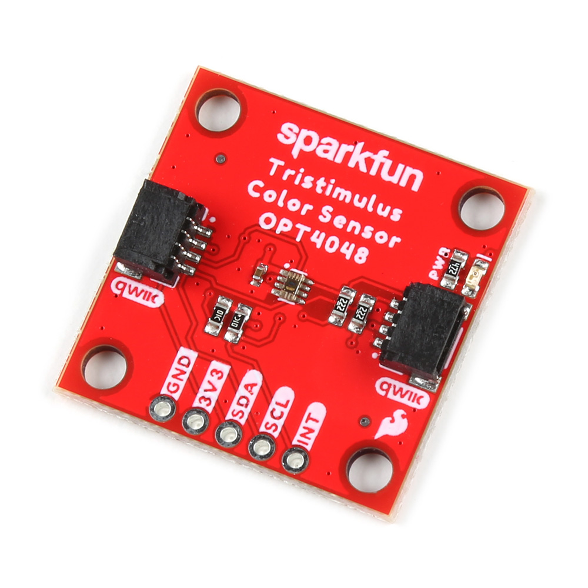
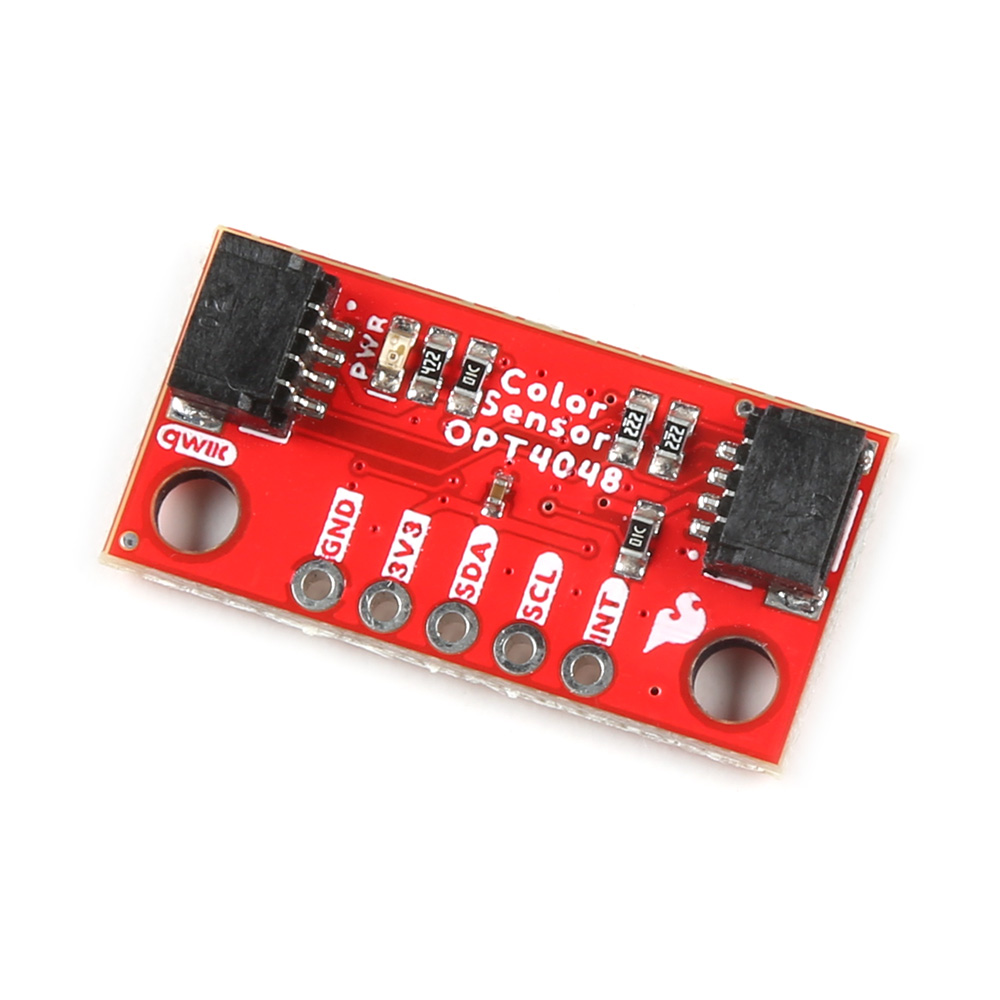

## Introduction

<!-- Double Product Card -->

<section class="grid cards col-2"markdown>

-	<a href="https://www.sparkfun.com/products/22638">
	**SparkFun Tristimulus Color Sensor - OPT4048DTSR (Qwiic)** 
	**SKU:** SEN-22638

	---

	<figure markdown>
	
	</figure>
	</a>

    The SparkFun Tristimulus Color Sensor - OPT4048DTSR (Qwiic) is built around the OPT4048 High Speed High Precision Tristimulus XYZ Color Sensor from Texas Instruments. It is a 1" x 1" Qwiic enabled board that can support up to 4 devices on a shared I2C bus - each capable of measuring four channels with specific engineered spectral responses.

	

    [Purchase from SparkFun :fontawesome-solid-cart-plus:{ .heart }](https://www.sparkfun.com/products/22638){ .md-button .md-button--primary }
    

-	<a href="https://www.sparkfun.com/products/22639">
	**SparkFun Mini Tristimulus Color Sensor - OPT4048DTSR (Qwiic)** 
	**SKU:** SEN-22639

	---

	<figure markdown>
	
	</figure></a>

    The Mini version of the SparkFun Tristimulus Color Sensor - OPT4048DTSR (Qwiic) maintains all the functionality of the 1" x 1" breakout board, but in a smaller footprint. 

	

	[Purchase from SparkFun :fontawesome-solid-cart-plus:{ .heart }](https://www.sparkfun.com/products/22639){ .md-button .md-button--primary }
	

</section>

## Required Materials
To get started, users will need a few items. Now some users may already have a few of these items, feel free to modify your cart accordingly.

-   <a href="https://www.sparkfun.com/products/22638">
    <figure markdown>
    
    </figure>

    ---

    **SparkFun Tristimulus Color Sensor - OPT4048DTSR (Qwiic)** 
    SEN-22638</a>

-   <a href="https://www.sparkfun.com/products/22639">
    <figure markdown>
    
    </figure>

    ---

    **SparkFun Mini Tristimulus Color Sensor - OPT4048DTSR (Qwiic)** 
    SEN-22639</a>

-   <a href="https://www.sparkfun.com/products/15123">
    <figure markdown>
    
    </figure>

    ---

    **SparkFun RedBoard Qwiic** 
    DEV-15123</a>

-   <a href="https://www.sparkfun.com/products/17259">
    <figure markdown>
    
    </figure>

    ---

    **Flexible Qwiic Cable - 100mm** 
    PRT-17259</a>

## Suggested Reading

If you aren’t familiar with the following concepts, we recommend checking out these tutorials before continuing.

-   <a href="https://www.sparkfun.com/qwiic">
    <figure markdown>
    
    </figure>
    
**Qwiic Connect System**
</a>

-   <a href="https://www.sparkfun.com/I2C">
    <figure markdown>
    
    </figure>
    
**I2C**
</a>

-   <a href="https://learn.sparkfun.com/tutorials/light">
    <figure markdown>
    
    </figure>
    
**Light**
</a>

